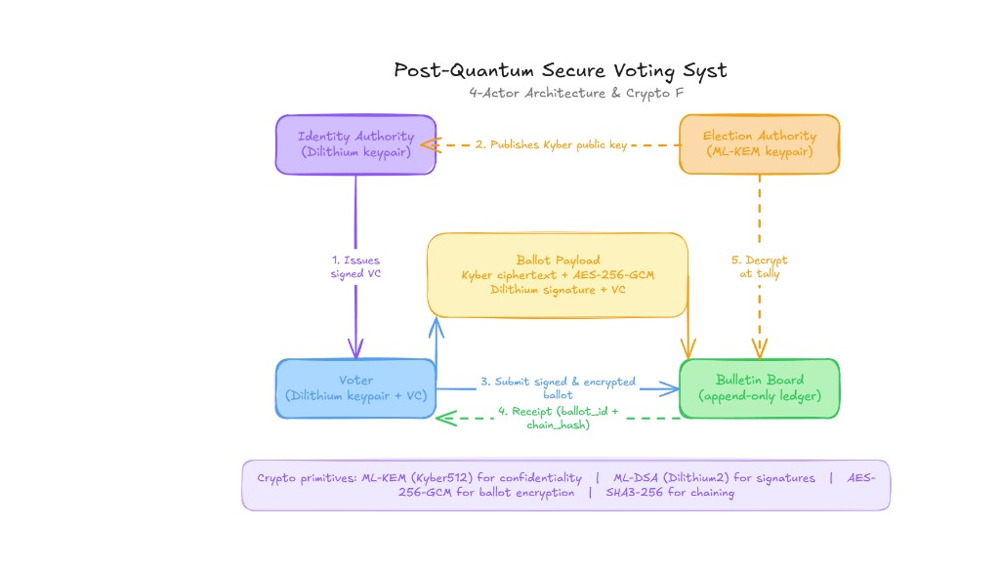

# Post-Quantum Secure Voting (Hackathon MVP)

**QuantumX** — E-voting prototype using **Kyber512** (ballot secrecy) and **Dilithium2 / ML-DSA-44** (signatures), with Identity Authority–signed voter credentials, electoral-roll checks, public bulletin board, and EA tally.

> **SDG 16:** Peace, justice & strong institutions — transparent, verifiable elections with quantum-safe cryptography.

## Submission package

| Item | File / URL |
|------|------------|
| **Presentation deck (PPT)** | [presentation/phase2_pitch.pptx](presentation/phase2_pitch.pptx) |
| **Web deck / PDF export** | [static/deck.html](static/deck.html) · [presentation/SLIDES.md](presentation/SLIDES.md) |
| **README** | This file |
| **Demo** | Install & run below · Checklist: [SUBMISSION.md](SUBMISSION.md) |

## Prerequisites

| Tool | Why |
|------|-----|
| [Git](https://git-scm.com/) | Clone the repository |
| [Docker Desktop](https://www.docker.com/products/docker-desktop/) | Runs API + liboqs (recommended on Windows) |
| Modern browser (Chrome / Edge / Firefox) | Voting UI + PQ crypto in the browser |

## Installation & run (Docker — recommended)

**First build may take 10–20 minutes** (compiles liboqs inside the image). Later starts are much faster.

### 1. Clone

```bash
git clone https://github.com/MDTOUFIQUE623/quantumx-hackathon.git
cd quantumx-hackathon
```

### 2. Start the app

```bash
docker compose up --build
```

Wait until you see something like: `Uvicorn running on http://0.0.0.0:8000`

### 3. Open in browser

Start here: **http://localhost:8000/demo.html**

### 4. Stop the app

Press `Ctrl+C` in the terminal, or in another terminal:

```bash
docker compose down
```

### Troubleshooting

| Problem | Fix |
|---------|-----|
| `docker: command not found` | Install and start **Docker Desktop** |
| Port 8000 already in use | Stop the other app, or change port in `docker-compose.yml` |
| Attack lab / API 404 | `docker compose restart api` then hard-refresh (`Ctrl+Shift+R`) |
| Vote page crypto fails | Hard-refresh; ensure `static/vendor/liboqs-js/` exists in your clone |
| Build fails on Windows | Use Docker (not local Python); enable WSL2 in Docker Desktop settings |

### Verify it works

```bash
# Health check (in a new terminal while Docker is running)
curl http://localhost:8000/api/health
# Expected: {"status":"ok"}
```

Run automated tests:

```bash
docker compose run --rm -v ./pq_voting:/app/pq_voting -v ./tests:/app/tests -e PYTHONPATH=/app api pytest tests/ -q
```

Expected: **33 passed**

| Page | URL |
|------|-----|
| **Judge demo guide** (start here) | http://localhost:8000/demo.html |
| Register & vote | http://localhost:8000/ |
| **Presentation deck** | http://localhost:8000/deck.html |
| Attack lab | http://localhost:8000/attacks.html |
| SDG 16 pitch | http://localhost:8000/pitch.html |
| Public bulletin board | http://localhost:8000/board.html |
| EA tally | http://localhost:8000/tally.html |
| Interop smoke test | http://localhost:8000/interop.html |
| API docs | http://localhost:8000/docs |

Hard-refresh static pages after updates: `Ctrl+Shift+R`

**Presenter scripts:** [DEMO_SCRIPT.md](DEMO_SCRIPT.md) · [PITCH.md](PITCH.md)

### Sample eligible voters (for judges)

| Name | DOB | Aadhaar-like ID | Constituency |
|------|-----|-----------------|--------------|
| Ananya Desai | 1998-04-12 | 900011112222 | MH-22-Pune |
| Kabir Singh | 1995-09-03 | 900033334444 | DL-07-Delhi |
| Priya Nair | 2000-01-28 | 900055556666 | KA-12-Bangalore |

On the vote page, click **Use** on a row or use quick-fill, then **Register**.

## Architecture

**4-actor architecture & crypto flow** (post-quantum secure voting):



### Actors

| Actor | Keys / role |
|-------|-------------|
| **Identity Authority (IA)** | Dilithium keypair — verifies electoral roll; issues signed voter credential (VC) |
| **Election Authority (EA)** | ML-KEM (Kyber512) keypair — encrypts/decrypts ballots at tally |
| **Voter** | Dilithium keypair + IA-signed VC — registers and casts ballot in browser |
| **Bulletin board** | Append-only ledger — stores ciphertexts, signatures, chain hashes (public view hides `voter_id`) |

### Flow (matches diagram)

| Step | Flow | What happens |
|------|------|----------------|
| **1** | IA → Voter | Issues signed credential after electoral-roll check |
| **2** | EA → system | Publishes Kyber public key for ballot encryption |
| **3** | Voter → Bulletin board | Submits signed + encrypted ballot (Kyber + AES-GCM + Dilithium + VC binding) |
| **4** | Bulletin board → Voter | Receipt: `ballot_id` + `chain_hash` |
| **5** | EA → Bulletin board | Decrypt at tally; publish anonymized counts |

### Ballot payload

- **Encrypted vote:** Kyber ciphertext + AES-256-GCM (`ballot_ciphertext`, `nonce`)
- **Integrity:** Dilithium signature over canonical ballot fields + IA credential checks

### Cryptographic primitives

| Purpose | Algorithm |
|---------|-----------|
| Confidentiality (KEM) | ML-KEM / **Kyber512** |
| Signatures | ML-DSA / **Dilithium2** |
| Ballot encryption | **AES-256-GCM** |
| Ledger chaining | **SHA3-256** |

## Browser dependency (vendored)

`static/vendor/liboqs-js/` is included in the repo so judges can vote after `git clone` without extra npm steps. To refresh:

```powershell
cd static/vendor
npm install @oqs/liboqs-js@0.15.1
Remove-Item -Recurse -Force liboqs-js -ErrorAction SilentlyContinue
Copy-Item -Recurse node_modules/@oqs/liboqs-js liboqs-js
```

See [static/vendor/README.md](static/vendor/README.md).

## Local Python (optional — advanced)

Not recommended on Windows unless you already built [liboqs](https://github.com/open-quantum-safe/liboqs) natively. **Use Docker above for judges.**

```bash
python -m venv .venv
# Windows:
.venv\Scripts\activate
# macOS / Linux:
# source .venv/bin/activate

pip install -r requirements.txt
```

**Windows (cmd):** `set PQ_VOTING_DATA_DIR=data`  
**macOS / Linux:** `export PQ_VOTING_DATA_DIR=data`

```bash
uvicorn pq_voting.api.main:app --reload --host 0.0.0.0 --port 8000
```

Then open http://localhost:8000/demo.html

## Project structure

```
pq_voting/          # Python backend (crypto, API, DB, IA roll)
static/             # UI (HTML, CSS, JS, deck.html, vendor)
docs/               # architecture.png (README diagram)
tests/              # pytest (33 tests)
presentation/       # phase2_pitch.pptx, SLIDES.md
DEMO_SCRIPT.md      # 5–7 min judge walkthrough
PITCH.md            # 2 min narrative
SUBMISSION.md       # Hackathon checklist
docker-compose.yml
Dockerfile
```

## Features completed

- [x] Post-quantum register / vote / verify / board / tally
- [x] Simulated electoral roll (IA eligibility check)
- [x] Public board without `voter_id` on public API
- [x] Attack lab (live API fraud demos)
- [x] Judge UI + plain-English explanations
- [x] Presentation deck (`deck.html` + `SLIDES.md`)

## Team

**Sidequest**

## License

Hackathon MVP — demo only, not for production elections.
